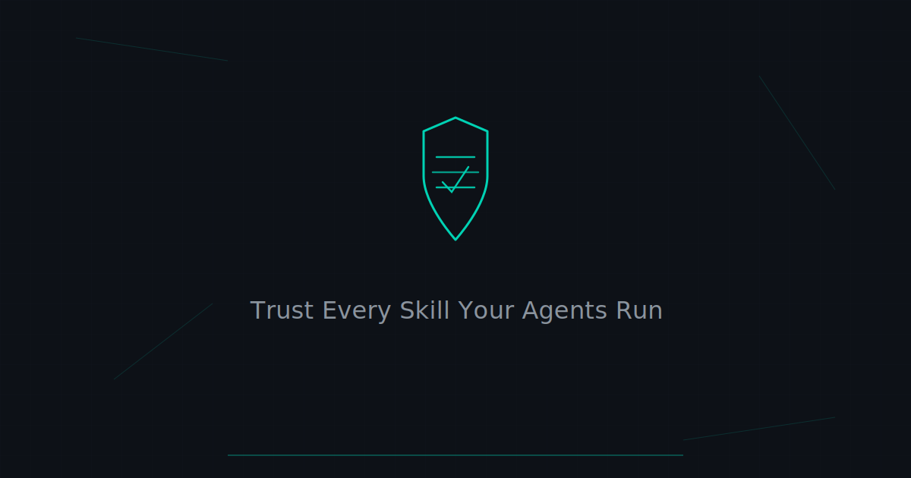

<p align="center">
  
</p>

<h1 align="center">Agent Audit</h1>
<p align="center">
  <strong>Audit every skill your AI agents run.</strong>
</p>

<p align="center">
  <a href="https://github.com/Markeljan/agent-audit">
    
  </a>
  <a href="https://github.com/Markeljan/agent-audit/blob/main/LICENSE">
    
  </a>
  <a href="https://owasp.org/www-project-agentic-skills-top-10/">
    
  </a>
  <a href="https://skills.sh">
    
  </a>
</p>

---

Install one skill. Every skill your agent uses gets audited automatically against the [OWASP Agentic Skills Top 10](https://owasp.org/www-project-agentic-skills-top-10/).

Supports **Claude Code**, **OpenClaw**, **Codex**, and more coming soon.

## Quick Start

```bash
npx agent-audit
```

That's it. Scans your current directory, finds every installed skill, and reports what it finds.

### Example Output

```
  agent-audit v0.1.0

  Scanning agent skills...
  Found 6 skills across 2 agents

  fetch-data
    FAIL  AST01  Malicious eval() in src/index.ts:14               critical
    FAIL  AST05  Unsanitized JSON.parse from user input             high

  deploy-helper
    WARN  AST03  Requests filesystem + network + exec               medium

  code-review
    PASS  All checks passed

  summarize-docs
    PASS  All checks passed

  db-migrate
    WARN  AST06  No process isolation configured                    medium

  lint-fix
    PASS  All checks passed

  6 skills scanned | 2 critical | 1 high | 2 medium | 0 low
  Policy: standard -- FAILED
```

## CLI Commands

```bash
# Scan current directory (auto-detects agent skills)
npx agent-audit

# Scan a specific path
npx agent-audit scan ./my-project

# Apply a policy preset
npx agent-audit scan --policy strict
npx agent-audit scan --policy enterprise

# Output formats
npx agent-audit scan --format json
npx agent-audit scan --format html --output report.html

# CI/CD gate -- exit 1 on policy violation
npx agent-audit check --fail-on high
```

See [`examples/`](./examples/) for full report samples in HTML, JSON, SARIF, and text formats.

## OWASP Agentic Skills Top 10

Every scan checks for all 10 risk categories:

| ID | Risk | What We Detect |
|----|------|----------------|
| **AST01** | Malicious Skills | Dangerous code patterns, known-malicious signatures |
| **AST02** | Supply Chain Compromise | Dependency provenance, transparency log gaps |
| **AST03** | Over-Privileged Skills | Excessive permission grants, least-privilege violations |
| **AST04** | Insecure Metadata | Schema validation failures, metadata integrity issues |
| **AST05** | Unsafe Deserialization | Parser safety gaps, injection vectors |
| **AST06** | Weak Isolation | Missing sandboxing, container misconfigurations |
| **AST07** | Update Drift | Unpinned versions, stale dependencies, hash mismatches |
| **AST08** | Poor Scanning | Coverage gaps, incomplete scanning pipelines |
| **AST09** | No Governance | Missing audit logs, absent policy enforcement |
| **AST10** | Cross-Platform Reuse | Platform-specific validation gaps, portability issues |

## Supported Agents

- **Claude Code** -- scans installed skills and MCP servers
- **OpenClaw** -- full SKILL.md manifest analysis
- **Codex** -- skill and plugin scanning
- More platforms coming soon

Browse the skills ecosystem at [skills.sh](https://skills.sh).

## Configuration

Create `agent-audit.config.ts` to customize policies and rules. See [DEMO.md](DEMO.md) for the full configuration reference.

## Contributing

See [CONTRIBUTING.md](CONTRIBUTING.md) for development setup and guidelines.

## License

[MIT](LICENSE)
